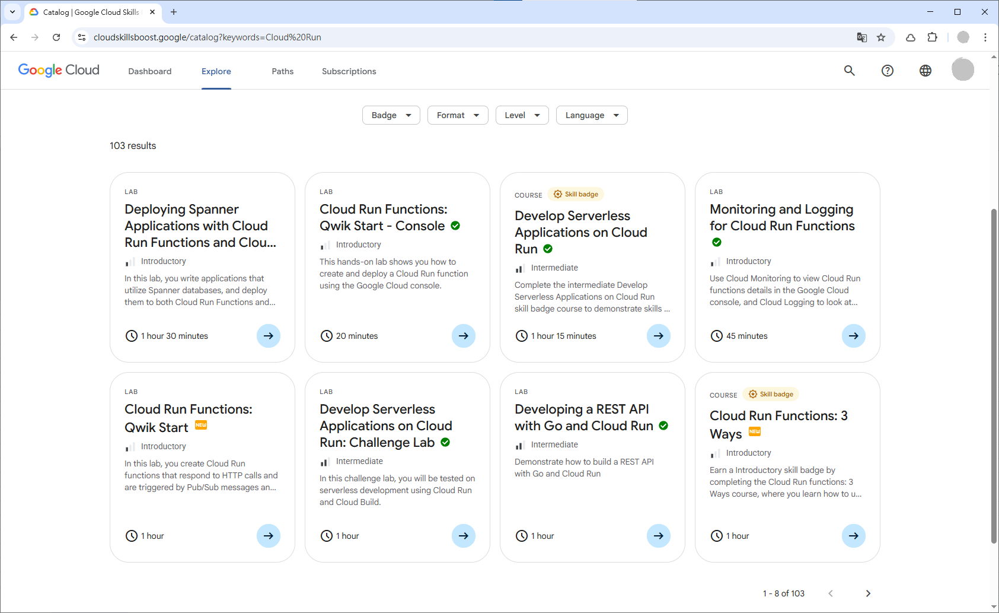
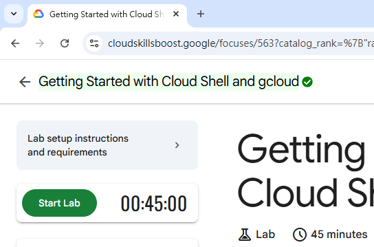
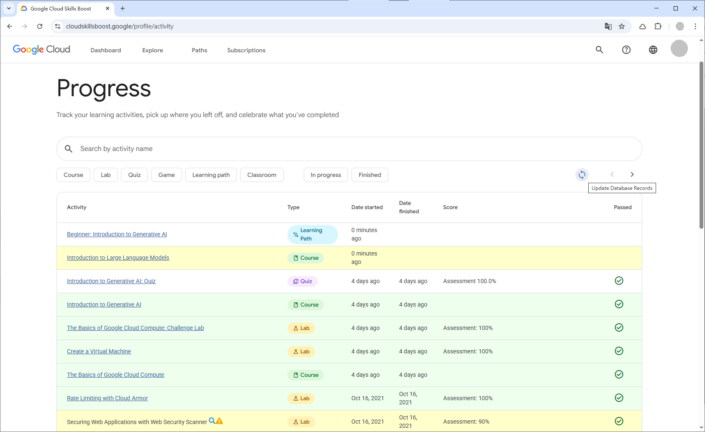

# Google Cloud Skills Boost Lab Completion Tracker

💡 **Label completed courses and labs on Google Cloud Skills Boost webpages**

[Google Cloud Skills Boost](https://www.cloudskillsboost.google) is a great online self-paced learning platform for getting hands-on experience of the Google Cloud Platform. It has over 400 hands-on labs and courses for learn and practice.

As a Google Cloud Skills Boost user, I found it cumbersome to identify unenrolled courses or incomplete labs from the Catalog and search results. This script offers a straightforward way to track your progress by visually marking items you have already completed.

   

🎯 **Objectives of this project**

- Develop a userscript to enhance the Google Cloud Skills Boost website.
- Indicate completed labs and courses on Catalog pages, making it easier to track learning progress and find new activities.
- Store and update the list of completed items locally in your browser's IndexedDB.

For more information, please read [**this post**](https://chriskyfung.github.io/blog/qwiklabs/Qwiklabs-User-Tips-for-Learning_Google_Cloud_Platform) on my GitHub Pages.

 

## 🛴 How to Use

This script requires a userscript manager, such as [Tampermonkey](https://chrome.google.com/webstore/detail/tampermonkey/dhdgffkkebhmkfjojejmpbldmpobfkfo) for Google Chrome, to run in your browser. Click the button below to install the script via your userscript manager.

## 🎠Features

*Note: The screenshots below are from a previous version of the userscript on the old Google Cloud Skills Boost website. The UI on the new Google Cloud Skills Boost website may look different.*

### 🌈 on your Dashboard page

Annotates lab and course cards in the "Stay on track" section based on your locally stored progress.

### 🌈 on a Catalog page

Retrieves local records and annotates catalog items:

- Marks completed labs and courses with a green check circle.
- Marks labs and courses not yet registered in the local database with a yellow 🆕 icon.

  

### 🌈 on a Course page

- Automatically creates a record in the local database for any unrecorded course you visit.
- Automatically updates the course name in the local database.
- Adds a green check circle next to the page title if the course is completed.

### 🌈 on a Lab page

- Automatically creates a record in the local database for any unrecorded lab you visit.
- Automatically updates the lab name in the local database.
- Adds a green check circle next to the lab title if the lab is completed.

  

### 🌈 on your Progress page

- Colors lab and course table rows for better readability.
- Provides a one-click button 🔄 to update the status of all labs and courses on the current page to your local database.
- Inserts pagination buttons to navigate through all your activities.
- Shows 🔍 quick search links for activities that are mismatched ⚠ with database records.

## 👀 Future Plans

[ ] [Sync IndexedDB across computers](https://github.com/chriskyfung/qwiklabs-completed-labs-tracker/issues/7) (#7)

## 💗 Support Me

If you find this project helpful, please consider supporting me. I would really appreciate it!

## 🤝 Contributing

Pull requests for new features, bug fixes, and suggestions are welcome! Please see the [contributing guidelines](.github/CONTRIBUTING.md) for more details.

## ⚖ License

Distributed under the [GNU General Public License v3.0](LICENSE)